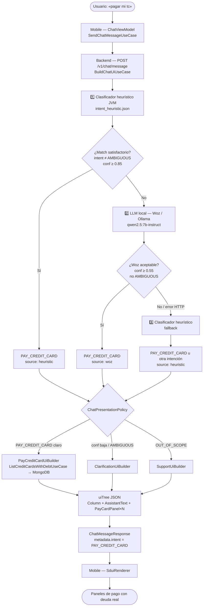
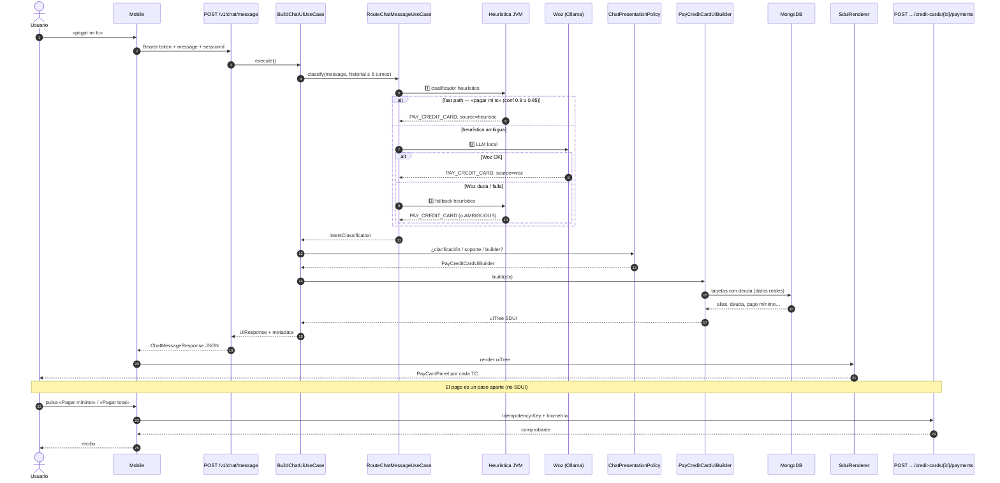
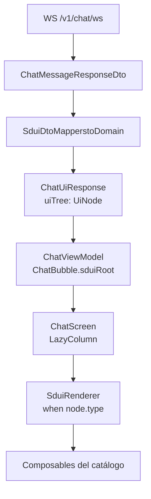
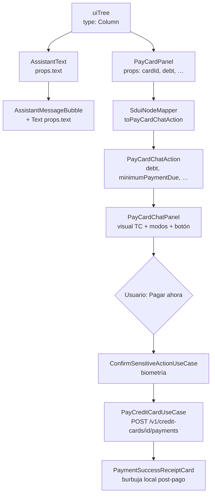
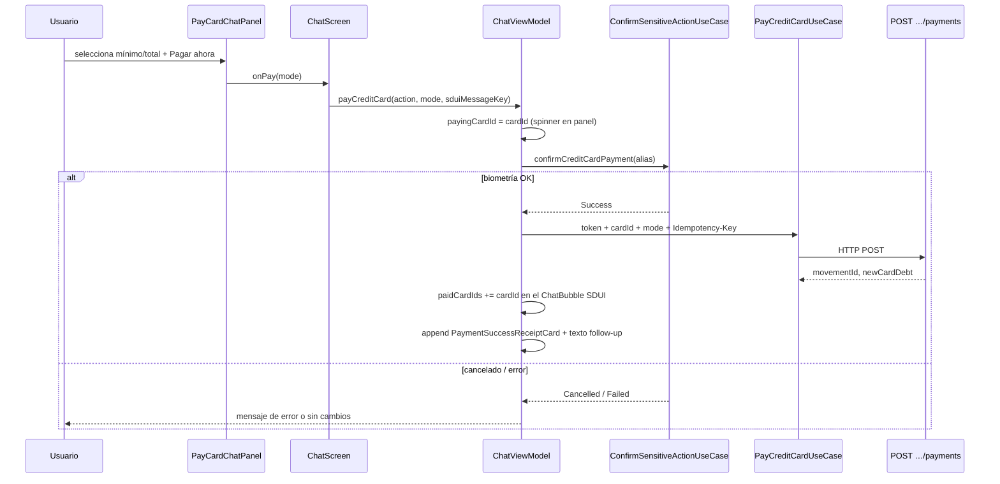

# Flujo del chat: «pagar mi tc» → clasificador → SDUI

Diagrama del recorrido cuando el usuario escribe **«pagar mi tc»** (u otra variante de pago de tarjeta) en el chat bancario.

La intención canónica en código es **`PAY_CREDIT_CARD`** (no existe el label `PAYMENT_TC`).

## Resumen en una frase

Mobile envía el mensaje → backend clasifica la intención en cascada (heurística → LLM local → heurística fallback) → con `PAY_CREDIT_CARD` claro, `BuildChatUiUseCase` arma un **`uiTree` SDUI** con deuda real desde MongoDB → mobile lo renderiza con `SduiRenderer`.

## Cascade del clasificador (modo `auto`, default)

En producción el router es **`CascadeIntentClassifier`**: tres pasos antes de armar la UI.



### Caso concreto: «pagar mi tc»

La frase está en `local/config/intent_heuristic.json` con **confianza 0.9** (regla `PAY_CREDIT_CARD`). En modo `auto` suele activarse el **fast path**: el paso 1 resuelve la intención **sin llamar a Ollama**. Los pasos 2 y 3 entran cuando la heurística no es suficientemente clara (p. ej. *«paga 50»* sin contexto).

## Secuencia end-to-end (clasificación + SDUI + pago)

El clasificador **solo etiqueta** la intención. El dinero **no** se mueve hasta que el usuario confirma en mobile y se llama al endpoint transaccional.



## Qué contiene el `uiTree` de pago

| Nodo SDUI | Origen del dato |
|-----------|-----------------|
| `AssistantText` | Copy grounded (`GroundedChatCopy.payCardsIntro`) |
| `PayCardPanel` × N | `ListCreditCardsWithDebtUseCase` → MongoDB (`cardId`, `debt`, `minimumPaymentDue`, …) |

Mobile **no** inventa montos ni clasifica: solo renderiza el catálogo fijo según `type`.

## Respuesta JSON del SDUI (`ChatMessageResponse`)

Tras clasificar `PAY_CREDIT_CARD`, `BuildChatUiUseCase` devuelve un **`ChatMessageResponse`** (mobile lo recibe por `WS /v1/chat/ws` dentro de un `ChatWsEnvelope`, o por `POST /v1/chat/message` con la misma forma).

### Caso típico — una tarjeta con deuda

Usuario demo `woz@bank.com` escribe **«pagar mi tc»**. La heurística resuelve con `source: heuristic` y `PayCreditCardUiBuilder` consulta MongoDB antes de armar el árbol.

```json
{
  "schemaVersion": 1,
  "correlationId": "a1b2c3d4-e5f6-7890-abcd-ef1234567890",
  "sessionId": "sess-01HXYZ",
  "userMessage": "pagar mi tc",
  "metadata": {
    "intent": "PAY_CREDIT_CARD",
    "confidence": 0.9,
    "clarificationNeeded": false,
    "reason": "matched rule PAY_CREDIT_CARD (anySubstring)",
    "routerSource": "heuristic"
  },
  "uiTree": {
    "id": "pay-root",
    "type": "Column",
    "props": {},
    "children": [
      {
        "id": "pay-intro",
        "type": "AssistantText",
        "props": {
          "text": "Encontré una tarjeta con deuda: Oro (4200.0 PEN). Indica el modo de pago:"
        },
        "children": [],
        "actions": []
      },
      {
        "id": "pay-card-0",
        "type": "PayCardPanel",
        "props": {
          "cardId": "card-gold-001",
          "alias": "Oro",
          "lastFourDigits": "1234",
          "cardholderName": "MARIA LOPEZ",
          "expiryMonth": "12",
          "expiryYear": "2028",
          "debt": "4200.0",
          "creditLine": "10000.0",
          "minimumPaymentDue": "420.0",
          "statementBalanceDue": "1200.0",
          "currency": "PEN"
        },
        "children": [],
        "actions": []
      }
    ],
    "actions": []
  }
}
```

**Notas sobre el contrato v1:**

| Campo | Detalle |
|-------|---------|
| `props` en nodos | Siempre `Map<String, String>` — montos van como string (`"4200.0"`), no número JSON. |
| `PayCardPanel.actions` | Vacío en la implementación actual; mobile arma los botones «Pagar mínimo / total» desde `props` vía `SduiNodeMapper.toPayCardChatAction()`. |
| `AssistantText.props.text` | Copy **grounded** desde `GroundedChatCopy.payCardsIntro()` — no lo redacta el LLM. |
| `metadata.routerSource` | `heuristic`, `woz` o `quick_reply` según quién clasificó. |

### Variante — varias tarjetas con deuda

Si el usuario tiene más de una TC con saldo pendiente, el intro cambia y hay un `PayCardPanel` por tarjeta:

```json
{
  "uiTree": {
    "id": "pay-root",
    "type": "Column",
    "props": {},
    "children": [
      {
        "id": "pay-intro",
        "type": "AssistantText",
        "props": {
          "text": "Tienes 2 tarjetas con deuda. Elige la tarjeta y el modo de pago:"
        },
        "children": [],
        "actions": []
      },
      {
        "id": "pay-card-0",
        "type": "PayCardPanel",
        "props": {
          "cardId": "card-gold-001",
          "alias": "Oro",
          "lastFourDigits": "1234",
          "cardholderName": "MARIA LOPEZ",
          "expiryMonth": "12",
          "expiryYear": "2028",
          "debt": "4200.0",
          "creditLine": "10000.0",
          "minimumPaymentDue": "420.0",
          "statementBalanceDue": "1200.0",
          "currency": "PEN"
        },
        "children": [],
        "actions": []
      },
      {
        "id": "pay-card-1",
        "type": "PayCardPanel",
        "props": {
          "cardId": "card-plat-002",
          "alias": "Platino",
          "lastFourDigits": "5678",
          "cardholderName": "MARIA LOPEZ",
          "expiryMonth": "6",
          "expiryYear": "2029",
          "debt": "850.0",
          "creditLine": "15000.0",
          "minimumPaymentDue": "85.0",
          "statementBalanceDue": "850.0",
          "currency": "PEN"
        },
        "children": [],
        "actions": []
      }
    ],
    "actions": []
  }
}
```

### Variante — sin deuda pendiente

Si `ListCreditCardsWithDebtUseCase` devuelve lista vacía, no hay `PayCardPanel`:

```json
{
  "uiTree": {
    "id": "pay-empty",
    "type": "Column",
    "props": {},
    "children": [
      {
        "id": "pay-empty-text",
        "type": "AssistantText",
        "props": {
          "text": "Revisé tus tarjetas y no encontré deuda pendiente en este momento."
        },
        "children": [],
        "actions": []
      }
    ],
    "actions": []
  }
}
```

### Envoltorio WebSocket (mobile)

En la app, el mismo payload llega envuelto:

```json
{
  "event": "message",
  "response": {
    "schemaVersion": 1,
    "correlationId": "…",
    "sessionId": "…",
    "userMessage": "pagar mi tc",
    "metadata": { "intent": "PAY_CREDIT_CARD", "confidence": 0.9, "clarificationNeeded": false, "reason": "…", "routerSource": "heuristic" },
    "uiTree": { "id": "pay-root", "type": "Column", "children": [ "…" ] }
  },
  "error": null
}
```

El pago en sí **no** forma parte de este JSON: al pulsar un botón del panel, mobile llama `POST /v1/credit-cards/{cardId}/payments` con header `Idempotency-Key`.

## Cómo mobile construye la UI desde el SDUI

Mobile **no interpreta la intención** ni vuelve a consultar tarjetas para armar el layout: recibe `uiTree`, lo deserializa y lo pinta con un catálogo Compose fijo (`SduiRenderer`).

### Pipeline en mobile



| Paso | Archivo | Qué hace |
|------|---------|----------|
| 1. Transporte | `RemoteHomeRepository.kt` | WebSocket autenticado → `ChatWsEnvelope.response` |
| 2. DTO → dominio | `SduiDtoMappers.kt` | `ChatMessageResponseDto.toDomain()` → `ChatUiResponse` con `UiNode` |
| 3. Estado | `ChatViewModel.kt` | Crea `ChatBubble(isUser=false, sduiRoot=response.uiTree)` |
| 4. Pantalla | `ChatScreen.kt` | Si `sduiRoot != null` → `SduiRenderer` (no burbuja de texto plano) |
| 5. Render | `SduiRenderer.kt` | `when (node.type)` → Composable existente |

### Flujo «pagar mi tc»: JSON → pantalla

Para el flujo de pago TC, el árbol SDUI se traduce así:



### Catálogo SDUI → Composable (flujo pago TC)

| `type` (SDUI) | Composable mobile | Props / acciones usadas |
|---------------|-------------------|-------------------------|
| `Column` | `Column` + recursión | Recorre `children[]` en orden |
| `AssistantText` | `AssistantMessageBubble` | `props.text` |
| `PayCardPanel` | `PayCardChatPanel` | `props` → `PayCardChatAction` vía `SduiNodeMapper` |

Otros tipos del catálogo (`BalanceCard`, `GreetingCard`, …) siguen el mismo patrón en `SduiRenderer.kt`. Tipo desconocido → `SduiFallback` (mensaje «Componente no soportado»).

### Mapeo `PayCardPanel` → panel interactivo

El backend envía strings en `props`; mobile los convierte a modelo tipado:

```kotlin
// SduiNodeMapper.kt — props del JSON → PayCardChatAction
props["cardId"]           → action.cardId
props["alias"]            → action.alias
props["debt"]             → action.debt (Double)
props["minimumPaymentDue"]→ action.minimumPaymentDue
props["currency"]         → action.currency
// … lastFourDigits, cardholderName, expiryMonth/Year, etc.
```

`PayCardChatPanel` **no lee `actions[]` del JSON** en v1. Los botones «PAGO MÍNIMO / PAGO TOTAL» y «Pagar ahora» son UI fija del Composable; el SDUI solo trae los montos reales en `props`.

### Qué ve el usuario (ejemplo «pagar mi tc»)

```
┌─────────────────────────────────────┐
│  Asistente (AssistantMessageBubble) │
│  "Encontré una tarjeta con deuda:   │
│   Oro (4200.0 PEN). Indica el modo  │
│   de pago:"                         │
└─────────────────────────────────────┘
┌─────────────────────────────────────┐
│  PayCardChatPanel                   │
│  ┌─ CreditCardChatVisual (Oro ****) │
│  DEUDA ACTUAL: S/ 4,200.00          │
│  [ PAGO MÍNIMO ] [ PAGO TOTAL ]     │
│  [      Pagar ahora      ]          │
└─────────────────────────────────────┘
```

Si hay varios `PayCardPanel` en el `Column`, `SduiRenderer` pinta un panel debajo del otro (con `Spacer` de 8 dp).

### Secuencia al pulsar «Pagar ahora»



Tras un pago exitoso, el mismo `PayCardPanel` muestra **«Pago realizado»** (botón deshabilitado) gracias a `paidCardIds` en el `ChatBubble` original; el comprobante es una **burbuja nueva** (`paymentReceipt`), no parte del SDUI del backend.

### Reglas de diseño en mobile

| Mobile **sí** hace | Mobile **no** hace |
|---------------------|-------------------|
| Deserializar `uiTree` y mapear `type` → Composable | Clasificar intención (`PAY_CREDIT_CARD`, etc.) |
| Formatear montos y mostrar modos de pago | `GET /v1/credit-cards/with-debt` para armar el chat |
| Ejecutar pago con biometría + idempotencia | Inventar deuda o saldos |
| Estado local: `payingCardId`, `paidCardIds`, recibo | Decidir layout según `metadata.intent` |

`metadata.intent` y `confidence` viajan en la respuesta pero **no** condicionan qué Composable se pinta: eso lo define únicamente la forma del `uiTree`.

## Referencias en código

| Pieza | Ubicación |
|-------|-----------|
| Cascade heurística → Woz → fallback | `backend/api/.../CascadeIntentClassifier.kt` |
| Reglas «pagar mi tc» | `local/config/intent_heuristic.json` |
| Orquestación SDUI | `backend/application/.../BuildChatUiUseCase.kt` |
| Builder pago TC | `backend/application/sdui/PayCreditCardUiBuilder.kt` |
| Renderer mobile | `mobile/.../presentation/sdui/SduiRenderer.kt` |
| Mapper PayCardPanel | `mobile/.../presentation/sdui/SduiNodeMapper.kt` |
| Panel pago TC | `mobile/.../presentation/ui/organisms/PayCardChatPanel.kt` |
| Estado chat + pago | `mobile/.../presentation/viewmodel/ChatViewModel.kt` |
| Pantalla chat | `mobile/.../presentation/screen/ChatScreen.kt` |
| Contrato completo de routing | [`intent-routing-contract.md`](intent-routing-contract.md) |
| Blueprint SDUI | [`server-driven-ui-blueprint.md`](server-driven-ui-blueprint.md) |

## Variables de entorno relevantes

| Variable | Default | Efecto |
|----------|---------|--------|
| `INTENT_ROUTER_MODE` | `auto` | Activa la cascada heurística → Woz → heurística |
| `INTENT_HEURISTIC_FAST_PATH_MIN_CONFIDENCE` | `0.85` | Umbral para omitir Ollama |
| `WOZ_MIN_CONFIDENCE_FOR_ACCEPT` | `0.55` | Si Woz está por debajo, vuelve a heurística |
| `WOZ_OLLAMA_BASE_URL` | `http://127.0.0.1:11434` | URL de Ollama |
