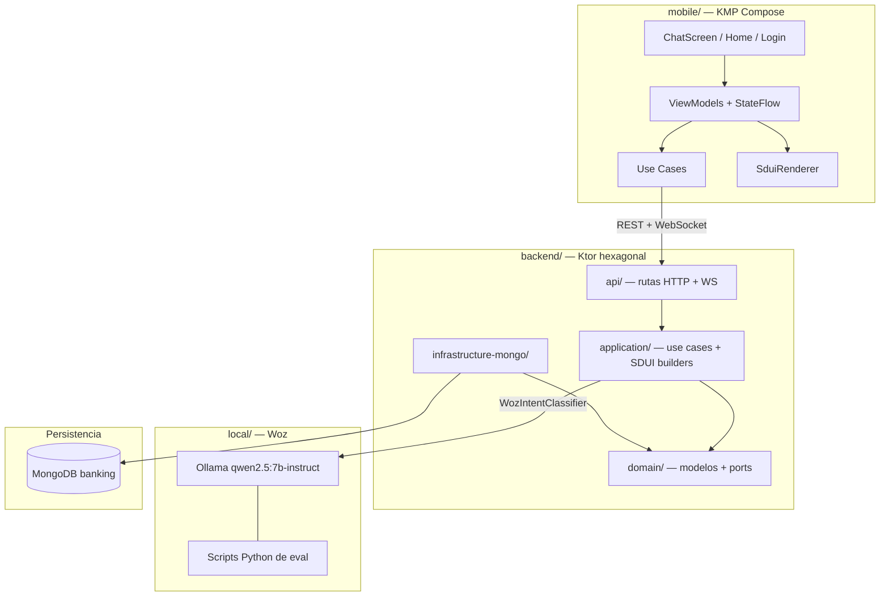
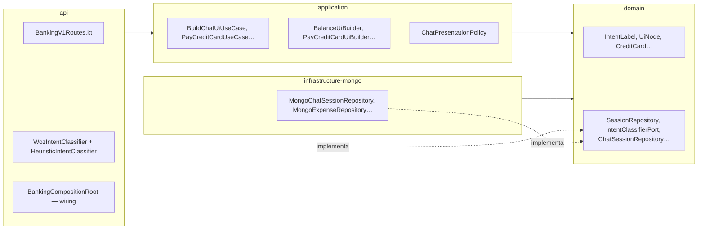
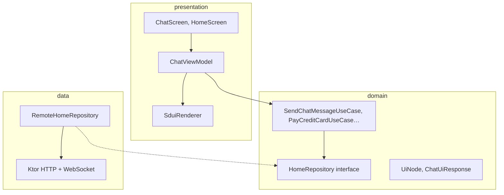
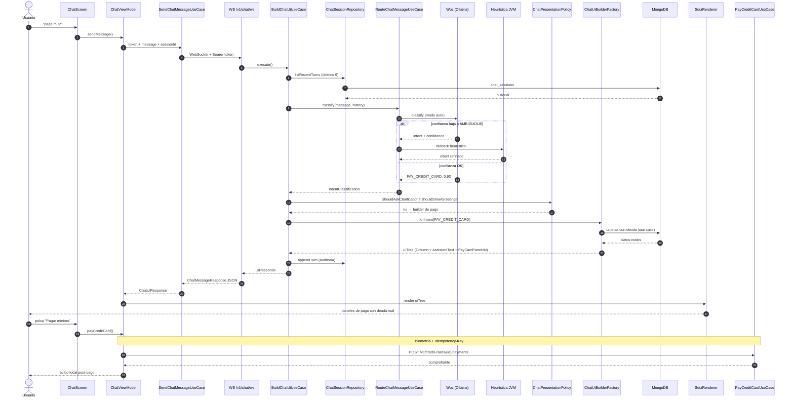
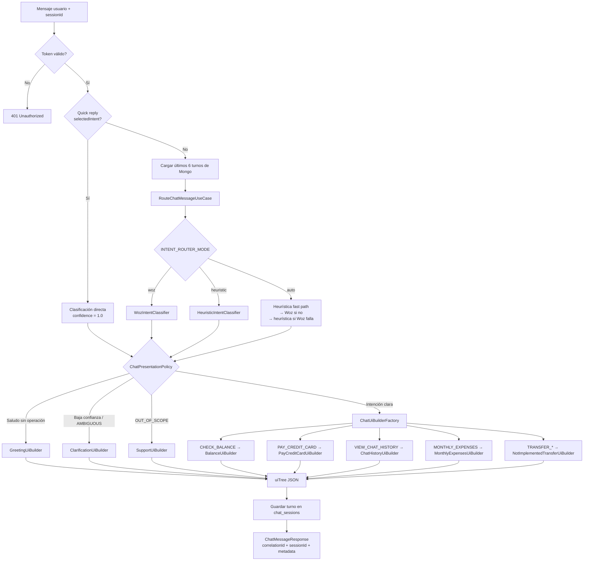
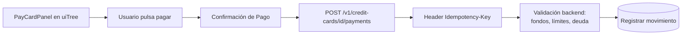

# Guía de arquitectura del proyecto y chat de IA

Documento de referencia sobre cómo funciona el repositorio **ia/**: app bancaria KMP, backend Ktor y asistente de chat con SDUI + Woz (Ollama).

## Visión general del proyecto

Es una **app bancaria real** para Android/iOS con tres piezas que corren de forma independiente pero se integran en el chat:

| Pieza | Stack | Rol |
|-------|-------|-----|
| **`mobile/`** | Kotlin Multiplatform + Compose | UI, sesión, render SDUI, pagos con confirmación |
| **`backend/`** | Kotlin JVM 21 + Ktor + MongoDB | API, reglas de negocio, clasificación IA, armado de UI |
| **`local/`** | Python + Ollama | LLM local (**Woz**) para clasificar intenciones y benchmarks |

Prioridades transversales: **seguridad**, **auditabilidad** (correlation IDs, historial de sesión) y **no inventar datos bancarios**.

---

## Arquitectura global



---

## Backend (hexagonal)

Cuatro módulos Gradle, de adentro hacia afuera:



**Regla clave:** la lógica de negocio vive en `application/`; las rutas Ktor solo validan auth y delegan.

---

## Mobile (Clean Architecture en un solo módulo)



El wiring manual está en `BankingApp.kt`: repositorios → use cases → ViewModels.

---

## Cómo funciona el chat de IA (flujo completo)

El chat **no es un LLM que redacta respuestas libres**. Es un **orquestador**:

1. **Woz** (LLM local) solo **clasifica la intención** del usuario.
2. El backend **consulta datos reales** en MongoDB (saldo, tarjetas, gastos…).
3. El backend **arma un árbol JSON** (`uiTree`) con componentes predefinidos (SDUI).
4. Mobile **solo renderiza** ese árbol; los pagos van por API transaccional aparte.

### Diagrama de secuencia (flujo principal)



### Diagrama de decisiones en el backend



---

## Piezas importantes del chat

### 1. Woz — clasificador IA (no ejecuta dinero)

- Corre en **Ollama** local (`qwen2.5:7b-instruct`).
- Recibe el mensaje + historial (últimos 6 turnos).
- Devuelve JSON: `{ intent, confidence, entities, clarification_needed, reason }`.
- Modo `auto` (default): **cascade** — heurística JVM primero (fast path); si no hay match claro → Woz; si Woz falla o duda → heurística otra vez. Ver [`docs/intent-routing-contract.md`](intent-routing-contract.md#cascade-heurística--llm-modo-auto).

Intenciones soportadas: `CHECK_BALANCE`, `PAY_CREDIT_CARD`, `TRANSFER_*`, `VIEW_CHAT_HISTORY`, `MONTHLY_EXPENSES`, `AMBIGUOUS`, `OUT_OF_SCOPE`.

### 2. SDUI — Server-Driven UI

El backend devuelve un árbol como este:

```json
{
  "uiTree": {
    "type": "Column",
    "children": [
      { "type": "AssistantText", "props": { "text": "..." } },
      { "type": "PayCardPanel", "props": { "cardId": "...", "debt": "4200.0" } }
    ]
  },
  "metadata": { "intent": "PAY_CREDIT_CARD", "confidence": 0.93, "routerSource": "woz" }
}
```

Mobile mapea cada `type` a un Composable fijo en `SduiRenderer` (`BalanceCard`, `PayCardPanel`, `GreetingCard`, etc.).

**Copy grounded:** el texto lo genera `GroundedChatCopy` con datos reales de Mongo, **no el LLM**, para no inventar montos.

### 3. Sesión multi-turn

- Colección Mongo `chat_sessions`.
- Primer mensaje sin `sessionId` → backend crea sesión y devuelve el ID.
- Mobile reenvía el mismo `sessionId` en cada mensaje del hilo.
- Woz usa el historial para follow-ups como *"paga 50"* o *"la oro"*.

### 4. Transporte: WebSocket

La app mobile usa **`WS /v1/chat/ws`**: abre conexión, envía un frame JSON, recibe `chat_response` y cierra.

Legacy / eval: `POST /v1/chat/route` (solo clasificación, sin SDUI).

### 5. Seguridad en pagos



El clasificador **nunca** ejecuta pagos. Solo sugiere qué UI mostrar.

---

## Otros flujos de la app (fuera del chat)

| Feature | Mobile | Backend |
|---------|--------|---------|
| Login | `LoginUseCase` | `POST /v1/auth/login` → token Bearer |
| Home / saldo | `GetBalanceUseCase` | `GET /v1/me/balance` |
| Movimientos / pagos | `GetPaymentsUseCase` | endpoints de tarjetas |
| Pago TC manual | `PayCreditCardUseCase` | `POST .../payments` + idempotencia |

---

## Cómo ponerlo en marcha (resumen)

1. **MongoDB** — datos de usuarios, tarjetas, sesiones de chat.
2. **Ollama + modelo** — clasificación Woz en el backend.
3. **Backend** — `cd backend && ./gradlew :api:run` → `:8080`.
4. **Mobile** — login demo `woz@bank.com` / `Demo1234!`, chat en tiempo real vía WebSocket.

Benchmarks opcionales:

```bash
python3 local/scripts/simulate_intent_validation.py
python3 local/scripts/simulate_woz_chat.py
```

---

## Documentación relacionada

| Documento | Contenido |
|-----------|-----------|
| [README.md](../README.md) | Puesta en marcha rápida |
| [AGENTS.md](../AGENTS.md) | Guía para desarrolladores y agentes |
| [server-driven-ui-blueprint.md](server-driven-ui-blueprint.md) | SDUI y catálogo de componentes |
| [intent-routing-contract.md](intent-routing-contract.md) | Intenciones, umbrales, mapeo API |
| [ai-chat-backend-blueprint.md](ai-chat-backend-blueprint.md) | Diseño objetivo del chat IA |
| [presentacion-dev-chat-ia.md](presentacion-dev-chat-ia.md) | Presentación técnica del chat |
