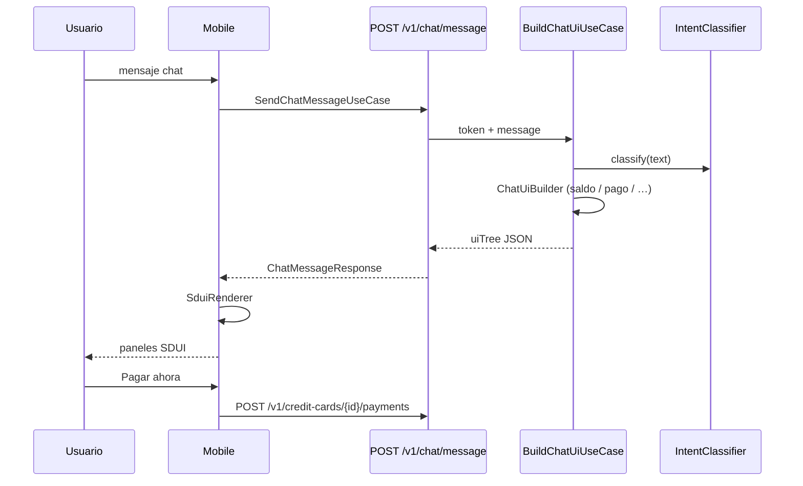

# Contrato de enrutamiento de intenciones

Documento canónico del flujo **texto del usuario → intención → acción sugerida → UI/API**.
Cualquier cambio en umbrales, labels o mapeos debe actualizar este archivo.

## Intenciones válidas

| Label | Descripción |
|-------|-------------|
| `CHECK_BALANCE` | Consultar saldo o cuentas |
| `PAY_CREDIT_CARD` | Pagar tarjeta de crédito |
| `TRANSFER_OWN_ACCOUNTS` | Transferencia entre cuentas propias |
| `TRANSFER_THIRD_PARTY` | Transferencia a terceros |
| `VIEW_CHAT_HISTORY` | Ver historial de conversaciones con el asistente |
| `MONTHLY_EXPENSES` | Gastos del mes agrupados por categoría |
| `AMBIGUOUS` | No se puede clasificar con confianza |
| `OUT_OF_SCOPE` | Fuera del alcance bancario del asistente |

Fuente de verdad en código:
- Backend enum: `backend/domain/.../IntentLabel.kt`
- Datasets: `local/datasets/intents/*.jsonl`
- Heurística JVM: `local/config/intent_heuristic.json`

## Flujo end-to-end



Legacy solo intención (eval / herramientas): `POST /v1/chat/route` → `RouteChatMessageUseCase` + `BackendRouteResolver`.

## Capas y responsabilidades

| Capa | Responsabilidad | No debe |
|------|-----------------|---------|
| **Woz** (`api/intent/` + Ollama) | Predecir `IntentLabel` + confidence | Ejecutar pagos ni consultar saldo real |
| **BuildChatUiUseCase** + `application/sdui/*` | Clasificar + armar `uiTree` con datos reales (Mongo) | Ejecutar pagos |
| **BackendRouteResolver** | Mapear intención → hints (ruta legacy `/chat/route`) | — |
| **SduiRenderer** (mobile) | Pintar catálogo Compose según `type` + props | Clasificar ni armar layout de negocio |
| **ChatViewModel** | Enviar mensaje, render SDUI, `PayCreditCardUseCase` al pulsar pagar | Inventar balances |

## Mapeo intención → API

| Intención | Endpoints sugeridos | Implementado |
|-----------|--------------------|--------------|
| `CHECK_BALANCE` | `GET /v1/me/balance` | Sí |
| `PAY_CREDIT_CARD` | `GET /v1/credit-cards/with-debt`, `POST /v1/credit-cards/{cardId}/payments` | Sí |
| `TRANSFER_OWN_ACCOUNTS` | `POST /v1/transfers/own` | **No** (`implemented = false`) |
| `TRANSFER_THIRD_PARTY` | `POST /v1/transfers/third-party` | **No** |
| `VIEW_CHAT_HISTORY` | `GET /v1/me/chat/history` | Sí |
| `MONTHLY_EXPENSES` | `GET /v1/me/expenses/by-category?yearMonth=YYYY-MM` | Sí |
| `AMBIGUOUS`, `OUT_OF_SCOPE` | (vacío) | — |

**Regla:** si `implemented = false`, la UI debe informar que la operación no está disponible;
no simular éxito de transferencia.

## Umbrales de confianza (estado actual)

> **Nota:** existen diferencias entre capas. Al unificar, actualizar esta tabla y los tests.

| Capa | Archivo | Umbral / comportamiento |
|------|---------|-------------------------|
| Mobile UI policy | `ChatPresentationPolicy.kt` (backend SDUI) | Clarificación si `confidence < 0.55` o `AMBIGUOUS` |
| OUT_OF_SCOPE recheck | `ChatPresentationPolicy.kt` | Re-check si `confidence < 0.8` y texto parece bancario |
| Local simulador | `simulate_woz_chat.py` | `ASK_CLARIFICATION` si `confidence < 0.55` |
| Backend heurístico | `HeuristicIntentClassifier.kt` | Reglas JSON + `BankingIntentKeywordResolver` si sigue `AMBIGUOUS` (p. ej. "pagando mi tc", saludo + operación) |
| Backend auto fallback | `IntentClassifierFactory.kt` | Fallback a heurística si confianza baja (~0.75) |
| Promotion LLM eval | `local/config/thresholds.json` | `minIntentAccuracyGlobal: 0.9`, etc. |

**Objetivo:** converger umbrales de clarificación en un solo config compartido o documentar
explícitamente por qué difieren (p. ej. mobile más conservador en UI).

## Next actions (simulador local / dialogue eval)

Usados en `dialogue_eval_v1.jsonl` y scripts `simulate_dialogue_validation.py`:

| Action | Cuándo |
|--------|--------|
| `SHOW_BALANCE` | `CHECK_BALANCE` con confianza suficiente |
| `SHOW_PAY_CARD_OPTIONS` | `PAY_CREDIT_CARD` |
| `SHOW_TRANSFER_GUIDE` | `TRANSFER_*` |
| `SHOW_SUPPORT` | `OUT_OF_SCOPE` |
| `ASK_CLARIFICATION` | `AMBIGUOUS` o baja confianza |

## Benchmarks obligatorios

Desde la **raíz del repo**:

```bash
python3 local/scripts/simulate_intent_validation.py
python3 local/scripts/simulate_dialogue_validation.py
```

Datasets:
- `local/datasets/intents/eval_v1.jsonl` — clasificación por frase
- `local/datasets/intents/dialogue_eval_v1.jsonl` — multi-turn

## Modos del clasificador (backend) — Woz

Variable `INTENT_ROUTER_MODE`:

| Modo | Comportamiento |
|------|----------------|
| `auto` (default) | **Woz** (Ollama local) con fallback heurístico JVM |
| `woz` | Solo Woz (`WozIntentClassifier`) |
| `heuristic` | Solo `local/config/intent_heuristic.json` |

Variables Woz: `WOZ_OLLAMA_BASE_URL`, `WOZ_MODEL`, `WOZ_TIMEOUT_SECONDS`, `WOZ_MIN_CONFIDENCE_FOR_ACCEPT`.

Requisito: **Ollama en marcha** con el modelo indicado (ver `local/README.md`).

Metadata SDUI: `routerSource` = `woz` \| `heuristic`.
