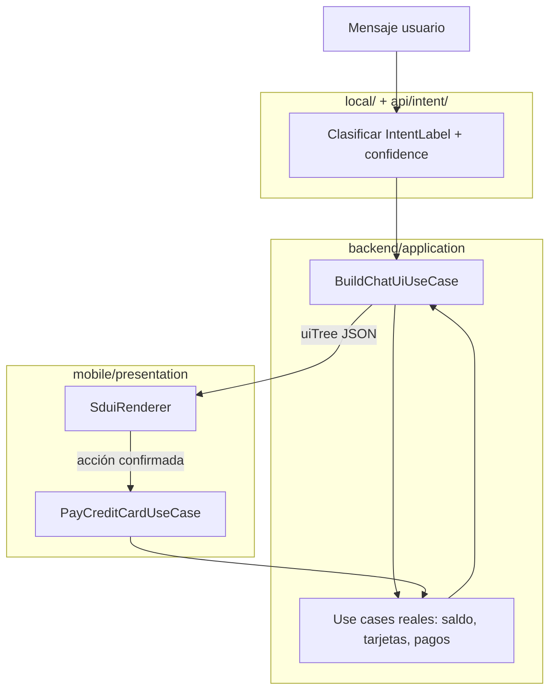
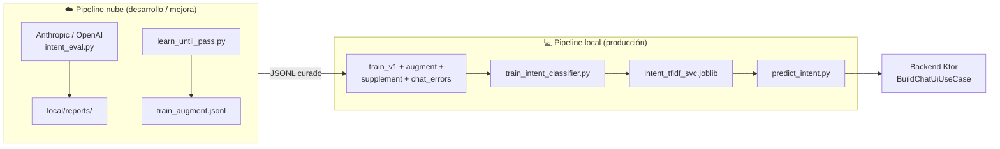
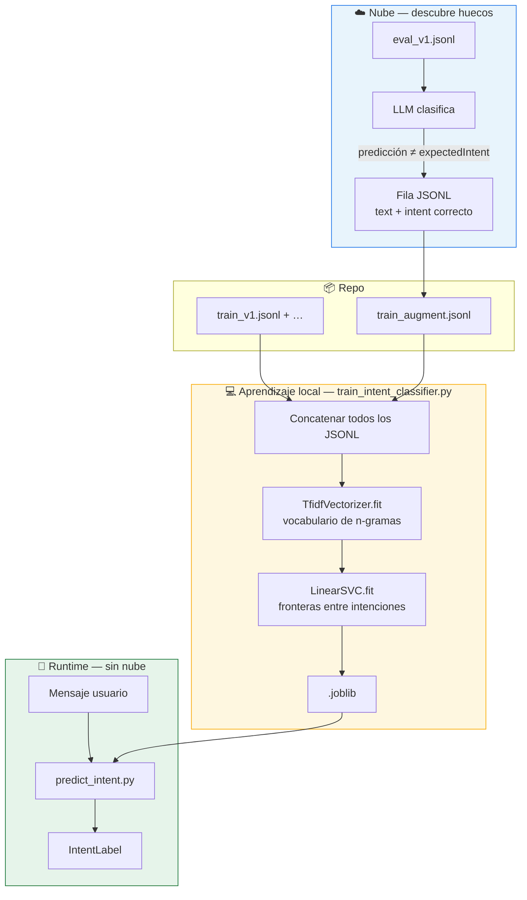
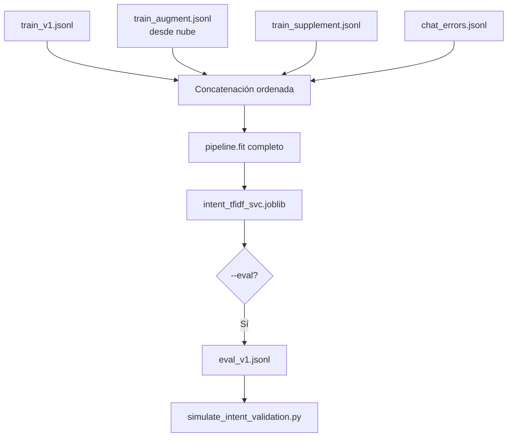
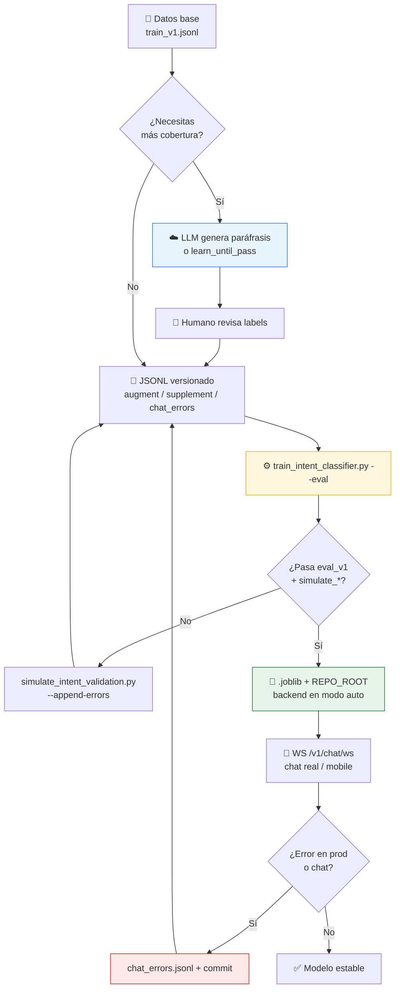
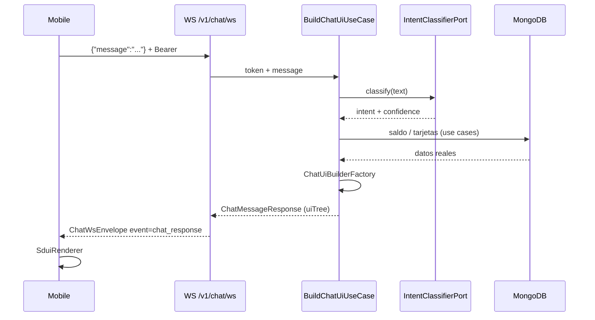
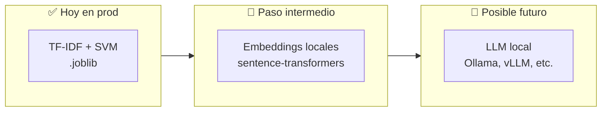

# Presentación para desarrolladores
## Chat bancario, Woz (LLM local) y SDUI

> **Actualización (2026):** producción usa **Woz** (Ollama), no TF-IDF/`.joblib`. Slides con sklearn = histórico.

**Audiencia:** backend, mobile, onboarding al repo  
**Duración sugerida:** 30–40 minutos  
**Mensaje central:** El chat usa **Woz** — copiloto con LLM **local** (sin tokens cloud). JSONL = benchmarks. SDUI + backend = datos y pagos reales.

**Documentación de referencia:** [`local/README.md`](../local/README.md) · [`docs/intent-routing-contract.md`](intent-routing-contract.md) · [`docs/server-driven-ui-blueprint.md`](server-driven-ui-blueprint.md)

---

## Slide 1 — Portada

**Repo `ia/` — arquitectura del asistente**

`mobile/` · `backend/` · `local/` · SDUI · WebSocket

*Woz (Ollama) en producción · benchmarks en `local/`*

---

## Slide 2 — Mapa del repositorio

| Carpeta | Stack | Responsabilidad |
|---------|-------|-----------------|
| [`mobile/`](../mobile/) | KMP + Compose Multiplatform | UI, `SduiRenderer`, pagos con idempotency |
| [`backend/`](../backend/) | Kotlin JVM 21, Ktor, MongoDB | API, `BuildChatUiUseCase`, clasificador en runtime |
| [`local/`](../local/) | Python + Ollama | Benchmarks Woz, `intent_heuristic.json` (fallback JVM) |
| [`docs/`](../docs/) | Markdown | Contratos, blueprints, esta presentación |

**Flujo principal del chat:** mobile → `WS /v1/chat/ws` → clasificar intención → armar `uiTree` (SDUI) → mobile renderiza → pago vía `POST /v1/credit-cards/{id}/payments`.

> **¿No sabes IA?** Lee el **slide 3** (glosario) antes de los slides de entrenamiento.

---

## Slide 3 — Glosario

| Término | En lenguaje simple | En este repo |
|---------|-------------------|--------------|
| **scikit-learn** | Librería Python de **machine learning clásico** (no es ChatGPT): entrena modelos pequeños con tablas de ejemplos | Usada en `train_intent_classifier.py` y dentro del `.joblib` |
| **`.jsonl`** | Archivo de texto: **una línea = un JSON** (una frase + su intención por línea). Fácil de versionar en Git y revisar en PR | `train_v1.jsonl`, `chat_errors.jsonl`, `eval_v1.jsonl` en `local/datasets/intents/` |
| **`.joblib`** | Archivo binario donde **joblib** (compañera de scikit-learn) **guarda el modelo ya entrenado** listo para cargar con `joblib.load()` | `local/models/intent_tfidf_svc.joblib` — lo lee `predict_intent.py` y el backend |
| **LLM** | Modelo tipo ChatGPT/Claude que **genera texto** y entiende lenguaje muy abierto | Solo en **scripts de desarrollo** (`intent_eval.py`), **no** en el chat del usuario |
| **Clasificador** | Programa que **elige una categoría fija** entre pocas opciones (como un `switch` entrenado con ejemplos) | Decide si el usuario quiere saldo, pagar tarjeta, etc. |
| **Intención** | La categoría elegida | `CHECK_BALANCE`, `PAY_CREDIT_CARD`, … |
| **Entrenamiento** | Enseñar con muchos pares **frase → categoría correcta** | scikit-learn lee `.jsonl` → escribe `.joblib` |
| **Inferencia** | Usar el modelo **ya entrenado** con una frase nueva | `predict_intent.py` carga `.joblib` en cada mensaje del chat |
| **Token** | Unidad de cobro en APIs cloud (cada llamada al LLM cuesta) | **Cero** en producción con nuestro `.joblib` |
| **TF-IDF** | Técnica dentro del pipeline scikit-learn: mira **qué palabras y pares de palabras** importan | Primera etapa del modelo guardado en `.joblib` |
| **Fine-tuning** | Re-entrenar un LLM gigante con tus datos | **No lo hacemos**; usamos scikit-learn + `.jsonl` |
| **Benchmark** | Examen fijo para comprobar que no rompimos nada | `eval_v1.jsonl` |

### Las tres piezas que verás en el día a día

| Pieza | Qué es | Analogía |
|-------|--------|----------|
| **`.jsonl`** | Cuaderno de ejemplos: cada línea es `{ "text": "...", "intent": "..." }` | Manual de frases que el banco acepta clasificar |
| **scikit-learn** | Motor que **estudia** ese cuaderno y aprende patrones | El proceso de estudiar el manual |
| **`.joblib`** | Resultado del estudio: archivo que el servidor **carga y ejecuta** | Operador que ya memorizó el manual |

**Flujo:** editas o generas **`.jsonl`** → corres entrenamiento (**scikit-learn**) → obtienes **`.joblib`** → el chat usa **`.joblib`** sin tocar la nube.

**Ejemplo de línea `.jsonl`:**
```json
{"text": "cuanto tengo en el banco", "intent": "CHECK_BALANCE"}
```

**Analogía útil:** el LLM en la nube es un **consultor caro** que ayuda a redactar el **manual de respuestas** (`.jsonl`); scikit-learn es quien **capacita al operador**; el `.joblib` es el **operador entrenado** que atiende miles de llamadas **sin pagar consultor por mensaje**.

---

## Slide 4 — Separación de responsabilidades



| Capa | Sí hace | No hace |
|------|---------|---------|
| **Clasificador** | Predecir intención | Consultar Mongo, ejecutar pagos |
| **BuildChatUiUseCase** | Clasificar + builders SDUI con datos reales | Ejecutar pagos |
| **Mobile** | Renderizar SDUI + confirmar pago | Clasificar intención ni armar layout de negocio |

---

## Slide 5 — Intenciones canónicas

Sincronizar en **código**, **datasets** y **heurística JVM**:

| Label | Uso |
|-------|-----|
| `CHECK_BALANCE` | Consulta de saldo |
| `PAY_CREDIT_CARD` | Pago de tarjeta |
| `TRANSFER_OWN_ACCOUNTS` | Transferencia propia *(API no implementada)* |
| `TRANSFER_THIRD_PARTY` | Transferencia a terceros *(API no implementada)* |
| `AMBIGUOUS` | Baja confianza → clarificación |
| `OUT_OF_SCOPE` | Fuera de alcance bancario |

Fuentes: `IntentLabel.kt` · `local/datasets/intents/*.jsonl` · `local/config/intent_heuristic.json`

---

## Slide 6 — Dos pipelines: nube vs local

**Regla de oro (léela aunque no sepas ML):** en el chat del usuario **nunca** corre Claude ni GPT. En la nube usamos LLM **solo en la laptop/CI del equipo** para encontrar frases que faltan en el entrenamiento. Lo que “baja” a producción son **líneas en archivos JSONL**, no el cerebro del LLM. Luego un script Python **vuelve a entrenar** un clasificador pequeño (`scikit-learn`).



---

## Slide 7 — Pipeline en la nube (detalle)

**Cuándo usarlo:** enriquecer datasets, comparar contra benchmark, bucle de corrección antes de entrenar sklearn.

| Script | Provider | Entrada | Salida |
|--------|----------|---------|--------|
| `intent_eval.py` | `anthropic` / `openai` / `rule` | `eval_v1.jsonl`, few-shot opcional | `local/reports/run-*.json`, `metrics-history.csv` |
| `learn_until_pass.py` | mismo | benchmark + umbrales `thresholds.json` | filas en `train_augment.jsonl`, `learning-progress.jsonl` |
| `finalize_intent_training.py --with-llm` | orquesta lo anterior | augment + errors + base | fusiona `train_v1.jsonl` + entrena sklearn |

**Requisitos nube:**

```bash
export ANTHROPIC_API_KEY="..."   # o OpenAI según --provider
python3 local/scripts/intent_eval.py --provider anthropic --version v1
python3 local/scripts/learn_until_pass.py --provider anthropic --session learn-1
```

**Qué hace `learn_until_pass`:** evalúa con LLM; por cada fallo en el benchmark, añade la fila con **ground truth** a `train_augment.jsonl` y reintenta hasta pasar el promotion gate o agotar iteraciones.

**Promotion gate** (`local/config/thresholds.json`): p. ej. `minIntentAccuracyGlobal: 0.9`.

---

## Slide 8 — Pipeline local: qué se usa, qué baja de la nube y cómo aprende

**Aclaración importante:** en **producción no hay LLM local**. Lo que corre en local es **scikit-learn** (Python + `numpy`). La nube **no transfiere “inteligencia”** al servidor: transfiere **ejemplos etiquetados** (`text` + `intent`) que el clasificador local **re-aprende** en cada entrenamiento.

---

### Qué se usa en local (stack completo)

| Fase | Herramienta | Qué hace |
|------|-------------|----------|
| **Entorno** | `local/venv/` + `requirements.txt` | Python 3.10–3.14, `scikit-learn`, `joblib` |
| **Entrenamiento** | `train_intent_classifier.py` | Lee JSONL, `pipeline.fit()`, escribe `.joblib` |
| **Artefacto** | `local/models/intent_tfidf_svc.joblib` | Pipeline serializado + metadatos (`intents`, `train_examples`) |
| **Inferencia (CLI)** | `predict_intent.py` | Carga `.joblib` → `pipeline.predict([text])` |
| **Inferencia (backend)** | `PythonScriptIntentClassifier` | Subproceso `predict_intent.py` vía `REPO_ROOT` |
| **Validación** | `simulate_intent_validation.py`, etc. | Regresión sobre `eval_v1.jsonl` sin llamar a la nube |
| **Respaldo** | `HeuristicIntentClassifier` + JSON | Si confianza baja en modo `auto` |

**Modelo local (prod):** `Pipeline[TfidfVectorizer → LinearSVC]` — no genera texto; **solo elige una de 6 etiquetas** mirando palabras de la frase.

```bash
source local/venv/bin/activate
pip install -r local/requirements.txt
python3 local/scripts/train_intent_classifier.py --eval
python3 local/scripts/predict_intent.py "quiero pagar la tarjeta"
```

---

### Qué baja de la nube (solo datos, no pesos)

| Origen nube | Qué se agrega | Archivo destino | ¿Entrena directo? |
|-------------|---------------|-----------------|-------------------|
| `learn_until_pass.py` | Frases del eval que el LLM falló + **intención correcta del benchmark** | `train_augment.jsonl` | **Sí** (al hacer `fit`) |
| Paráfrasis curadas (LLM/IDE + revisión humana) | Nuevas formas de decir lo mismo | `train_supplement.jsonl` / `train_v1.jsonl` | **Sí** |
| Errores en chat o benchmark | Frase real + corrección manual | `chat_errors.jsonl` | **Sí** (solo líneas con `intent`) |
| `intent_eval.py` | Reportes de accuracy e incidentes | `local/reports/run-*.json` | **No** — solo diagnóstico |

**No baja:** pesos de Claude/OpenAI, fine-tuning, ni respuestas del LLM como verdad. Si el LLM acierta pero sklearn falla, lo que se guarda es la **etiqueta humana/benchmark**, no la predicción del LLM.

**LLM en nube (solo dev):** default `claude-sonnet-4-6` (`ANTHROPIC_MODEL`) o `gpt-4o-mini` con `--provider openai`.

---

### Cómo aprende local lo que bajó de la nube

No es “bajar un cerebro”. Es **supervised learning clásico**: más filas `(texto, intención)` → **reentrenamiento completo** → nuevo `.joblib`.

**Pasos concretos:**

1. **Nube encuentra un hueco** — p. ej. el LLM (o sklearn actual) clasifica mal *"abonar la visa"* en el benchmark; la intención correcta es `PAY_CREDIT_CARD`.
2. **Se persiste una fila JSONL** — p. ej. en `train_augment.jsonl`:
   ```json
   {"text": "abonar la visa", "intent": "PAY_CREDIT_CARD", "meta": {"source": "learn_until_pass"}}
   ```
3. **Commit / pull** — el equipo comparte esos JSONL en Git (augment, supplement, `chat_errors`).
4. **`train_intent_classifier.py` fusiona** (orden fijo):
   ```text
   train_v1.jsonl + train_augment.jsonl + train_supplement.jsonl + chat_errors (con intent)
   ```
5. **`pipeline.fit(texts, labels)`** — **fit completo desde cero** (no incremental en caliente):
   - **`TfidfVectorizer`:** aprende qué **palabras y pares de palabras** importan en cada frase (p. ej. *"pagar"* + *"tarjeta"* juntos → señal fuerte de pago).
   - **`LinearSVC`:** dibuja **fronteras** entre las 6 intenciones usando esas señales. Más ejemplos de “pagar tarjeta” **empujan** la frontera a cubrir frases parecidas.
6. **Se guarda** `intent_tfidf_svc.joblib` — vocabulario + fronteras quedan **congelados** en disco (como guardar un `if/else` muy grande aprendido de datos).
7. **En producción** — el backend pasa el mensaje a `predict_intent.py`, que aplica las mismas reglas aprendidas. **Sin internet, sin API, sin tokens.**

**Resumen en una frase:** la nube dice *“falta enseñar esta frase con esta etiqueta”*; el script local **vuelve a estudiar todas las frases** y guarda un archivo; el chat **solo lee ese archivo**.



**Analogía:** la nube es un **profesor que señala ejercicios que faltan**; el `.joblib` es el **alumno que memoriza patrones** de esos ejercicios. Cada entrenamiento el alumno **vuelve a estudiar todo el cuaderno** (base + lo nuevo), no recibe una copia del cerebro del profesor.

**Qué mejora tras bajar data de la nube:** frases **parecidas en palabras** a las filas añadidas (mismos n-gramas). **Qué no mejora automáticamente:** sinónimos muy lejanos sin ejemplos equivalentes en JSONL — ahí hace falta más data o embeddings (`sentence-transformers`).

---

### Pros, contras y alternativas

| | TF-IDF + LinearSVC (actual) |
|---|---------------------------|
| **Pros** | Cero tokens en prod; latencia baja; artefacto pequeño; determinista; sin GPU; datasets auditables en Git |
| **Contras** | Aprende por **lexico/n-gramas**, no por “significado profundo”; requiere re-`fit` completo; no hereda razonamiento del LLM |

| Alternativa | Cuándo | Trade-off |
|-------------|--------|-----------|
| **Más JSONL curado** (recomendado) | Antes de cambiar stack | Mismo mecanismo de aprendizaje, mejor cobertura |
| **sentence-transformers** | Paráfrasis muy distintas del train | Mejor semántica; PyTorch + Py 3.11/3.12 |
| **LLM en prod** | No para routing masivo en banca | Costo, latencia, variabilidad |

Ver comparativa ampliada en **slide 17** (LLM local tipo Ollama, embeddings, etc.).



---

## Slide 9 — Ciclo completo: de la nube al `.joblib`



**Flujo útil documentado:** LLM genera borrador → humano corrige → entrenas sklearn → benchmarks en verde → backend consume `.joblib`.

---

## Slide 10 — Datasets JSONL

| Archivo | Git | Rol |
|---------|-----|-----|
| `train_v1.jsonl` | Sí | Base manual (`text`, `intent`) |
| `train_augment.jsonl` | Opcional | Salida de `learn_until_pass.py` |
| `train_supplement.jsonl` | Opcional | Frases extra a mano |
| `chat_errors.jsonl` | **Sí** | Fallos corregidos con `intent` |
| `eval_v1.jsonl` | Sí | **Benchmark fijo** — no auto-modificar al entrenar |
| `dialogue_eval_v1.jsonl` | Sí | Multi-turn: intención + next action |

Formato mínimo de entrenamiento:

```json
{"text": "cuanto tengo en el banco", "intent": "CHECK_BALANCE"}
```

Ver ciclo detallado: [`local/datasets/intents/README.md`](../local/datasets/intents/README.md)

---

## Slide 11 — Validación obligatoria

Antes de merge si tocas datasets o clasificador:

```bash
python3 local/scripts/train_intent_classifier.py --eval
python3 local/scripts/simulate_intent_validation.py
python3 local/scripts/simulate_dialogue_validation.py
```

| Script | Dataset | Qué valida |
|--------|---------|------------|
| `simulate_intent_validation.py` | `eval_v1.jsonl` | Clasificación por frase |
| `simulate_dialogue_validation.py` | `dialogue_eval_v1.jsonl` | Intención + acción conversacional |
| `simulate_local_chat.py` | `.joblib` en memoria | Chat interactivo sin mobile |

Flags útiles:

```bash
python3 local/scripts/simulate_intent_validation.py --append-errors
python3 local/scripts/simulate_intent_validation.py --interactive --record-chat
```

---

## Slide 12 — Clasificador en el backend (runtime)

`IntentClassifierFactory` (`backend/api/.../intent/`):

| `INTENT_ROUTER_MODE` | Comportamiento |
|----------------------|----------------|
| `auto` (default) | **Cascade**: heurística (fast path) → Woz → heurística si Woz falla o duda |
| `woz` | Solo `WozIntentClassifier` (Ollama) |
| `heuristic` | Solo `local/config/intent_heuristic.json` |

**Variables de entorno:**

| Variable | Uso |
|----------|-----|
| `WOZ_OLLAMA_BASE_URL`, `WOZ_MODEL`, `WOZ_TIMEOUT_SECONDS` | Cliente Ollama |
| `WOZ_MIN_CONFIDENCE_FOR_ACCEPT` | Default `0.55`; tras Woz en `auto`, por debajo → heurística |
| `INTENT_HEURISTIC_FAST_PATH_MIN_CONFIDENCE` | Default `0.85`; heurística aceptada sin LLM |
| `REPO_ROOT` / `INTENT_HEURISTIC_CONFIG` | Ubicación del JSON heurístico |

Contrato: [`docs/intent-routing-contract.md`](intent-routing-contract.md#cascade-heurística--llm-modo-auto).

```bash
cd backend && REPO_ROOT=.. ./gradlew :api:run
```

---

## Slide 13 — Del mensaje al `uiTree` (SDUI + WebSocket)



- **HTTP legacy:** `POST /v1/chat/message` (misma lógica de UI).
- **Pagos:** SDUI no ejecuta dinero; mobile → `PayCreditCardUseCase` + header `Idempotency-Key`.
- Blueprint SDUI: [`docs/server-driven-ui-blueprint.md`](server-driven-ui-blueprint.md)

---

## Slide 14 — Mobile (resumen técnico)

| Pieza | Ubicación |
|-------|-----------|
| Envío chat | `RemoteHomeRepository` → `WS /v1/chat/ws` |
| Estado | `ChatViewModel` + `ChatBubble(sduiRoot)` |
| Render | `presentation/sdui/SduiRenderer.kt` |
| Pago | `PayCreditCardUseCase` tras confirmación en panel SDUI |

**Regla:** no clasificar intención en ViewModel para respuestas del bot; consumir `uiTree` del backend.

Tests: `commonTest/.../sdui/SduiNodeMapperTest.kt`, ViewModel tests de flujos transaccionales.

---

## Slide 15 — Cheatsheet de comandos

```bash
# Ollama + Woz (desde raíz ia/)
ollama pull qwen2.5:7b-instruct
python3 local/scripts/predict_intent_woz.py "paga mi tc"

# Validación pre-merge (requiere Ollama)
python3 local/scripts/simulate_intent_validation.py
python3 local/scripts/simulate_dialogue_validation.py
python3 local/scripts/intent_eval.py --provider woz --version woz-v1

# Eval cloud opcional (dev)
export ANTHROPIC_API_KEY="..."
python3 local/scripts/intent_eval.py --provider anthropic --version v1

# Backend + mobile
cd backend && ./gradlew :api:run
cd mobile && ./gradlew :composeApp:installDebug
cd backend && ./gradlew test
cd mobile && ./gradlew :composeApp:testDebugUnitTest
```

Ver [`local/README.md`](../local/README.md).

---

## Slide 16 — Checklist antes de merge

- [ ] Labels alineados: Kotlin enum ↔ JSONL ↔ `intent_heuristic.json`
- [ ] `simulate_intent_validation.py` exit 0 (Ollama en marcha)
- [ ] `simulate_dialogue_validation.py` exit 0 (si tocaste diálogo)
- [ ] `intent_eval.py --provider woz` pasa promotion gate (opcional pero recomendado)
- [ ] Backend tests en `application/src/test/.../sdui/` si cambiaste builders
- [ ] Mobile tests SDUI si añadiste `type` al catálogo
- [ ] Actualizar [`docs/intent-routing-contract.md`](intent-routing-contract.md) si cambiaron umbrales o mapeos
- [ ] `unsafe_execution_count == 0`: clasificador nunca dispara pago directo

Matriz completa: [`docs/testing-matrix.md`](testing-matrix.md)

---

## Slide 17 — Clasificador local: Woz (Ollama)

**Estado actual:** el chat en producción usa **Woz** — LLM local vía Ollama (`qwen2.5:7b-instruct` por defecto), no sklearn ni `.joblib`.

| Entorno | Tecnología | Rol |
|---------|------------|-----|
| **Producción (`auto`)** | Heurística JVM → Woz (Ollama) → heurística | Clasificación en runtime; fast path sin LLM en frases típicas |
| **Solo LLM** | Woz + Ollama | `INTENT_ROUTER_MODE=woz` |
| **Solo reglas** | `intent_heuristic.json` | `INTENT_ROUTER_MODE=heuristic` |
| **Dev opcional** | `intent_eval.py --provider anthropic\|openai` | Comparar contra benchmark fijo |

Slides anteriores que mencionan TF-IDF, `.joblib`, `train_intent_classifier.py` o `learn_until_pass.py` son **históricas** (pipeline sklearn retirado).

### Opciones si quisiéramos IA “grande” en local



| Opción | Qué es (sin jerga) | Ventajas | Desventajas | ¿En el repo? |
|--------|-------------------|----------|-------------|--------------|
| **Clasificador actual** | Tabla de palabras importantes + reglas numéricas | Rápido, barato, predecible, sin GPU | Falla si el usuario habla muy distinto al entrenamiento | **Sí — prod** |
| **Embeddings locales** | Modelo pequeño que entiende “significado” de frases | Mejor con paráfrasis lejanas | Más RAM, PyTorch, Python 3.11–3.12 | Dependencias listas; **no** es el router actual |
| **LLM local (Ollama, etc.)** | ChatGPT corriendo en tu servidor | Sin API key en prod; útil en dev offline | Lento sin GPU; respuestas variables; más ops | **No implementado** |
| **LLM cloud en prod** | Claude/GPT por mensaje | Máxima flexibilidad lingüística | **Costo por token**, latencia, riesgo en banca | **Descartado** para routing masivo |

### ¿Por qué no pusimos ChatGPT local en prod?

1. **Costo operativo:** aunque no pagues tokens, consumes **CPU/GPU/RAM** en cada mensaje.
2. **Latencia:** milisegundos (clasificador) vs segundos (LLM).
3. **Variabilidad:** el mismo texto puede clasificarse distinto entre versiones del modelo.
4. **Seguridad bancaria:** el LLM **no debe** ser fuente de saldos ni pagos — ya lo resuelve el backend; solo necesitamos **routing** fiable.
5. **Alcance acotado:** 6 intenciones fijas → un clasificador entrenado suele ser **suficiente y auditable**.

### ¿Cuándo sí tendría sentido un LLM local?

- **Desarrollo sin API keys:** generar paráfrasis para JSONL con Ollama.
- **Extracción de entidades** complejas (monto, beneficiario) con salida JSON estricta.
- **Asistente conversacional más abierto** en fases futuras — aun así, **pagos** seguirían yendo al backend con confirmación.

**Recomendación del repo:** primero **más JSONL curado** (con ayuda cloud); luego **embeddings locales** si TF-IDF se queda corto; **LLM local en prod** solo si el producto lo exige y con las mismas reglas: backend = autoridad del dinero.

---

## Slide 18 — Preguntas frecuentes (Q&A dev)

**¿Por qué no usar el LLM directo en producción?**  
Costo por token, latencia, variabilidad y riesgo de “inventar” respuestas. El clasificador local elige una **categoría fija**; montos y pagos vienen de Mongo vía use cases.

**¿El LLM entrena el `.joblib`?**  
No copia su cerebro. Solo aporta **filas de entrenamiento** (frase + intención correcta); sklearn hace un `fit` completo.

**¿Puedo usar Ollama / un LLM en mi máquina como en la nube?**  
Sí en general, pero **no está integrado** en este repo. Ver slide 17. Para prod routing seguimos con `.joblib`.

**¿Puedo commitear el `.joblib`?**  
No está en Git. Regenera con `train_intent_classifier.py` o copia el archivo entre entornos compatibles.

**¿Qué pasa si no hay `REPO_ROOT`?**  
Modo `auto` cae a heurística JVM; pierdes el modelo sklearn hasta configurar rutas.

**¿Mobile usa `/v1/chat/route`?**  
No para UI; chat SDUI va por WebSocket (o `POST /v1/chat/message`). `/chat/route` es legacy de clasificación.

**No entiendo TF-IDF / SVM — ¿qué toco yo como backend/mobile dev?**  
Casi nada del algoritmo: tocas **JSONL** si añades frases, corres **scripts de validación**, y consumes **`IntentLabel`** + SDUI en backend/mobile. El slide 3 resume el vocabulario.

---

## Notas para el presentador

- **Slide 3 obligatorio** si hay devs sin ML — ~5 min de glosario evita confusiones después.
- **Bloque 1 (slides 2–5):** arquitectura repo — ~5 min.
- **Bloque 2 (slides 6–11):** nube vs local — **~15 min**; demo opcional de `train_intent_classifier.py --eval`.
- **Bloque 3 (slides 12–14):** runtime backend + SDUI — ~10 min.
- **Slide 17:** expectativas sobre LLM local — ~5 min si preguntan “¿por qué no ChatGPT?”.
- **Cierre (15–18):** comandos, checklist, Q&A — ~5 min.
- Enfatizar: **nube = costo acotado en CI/dev**; **local = costo cero por mensaje en prod**.

---

## Cómo visualizar este documento

- **VS Code / Cursor:** vista previa Markdown (`Cmd+Shift+V` / `Ctrl+Shift+V`).
- **GitHub:** Mermaid nativo en `docs/presentacion-dev-chat-ia.md`.
- **Presentación negocio (pareja):** [`docs/presentacion-negocio-chat-ia.md`](presentacion-negocio-chat-ia.md) — slide 9: IA local vs nube en lenguaje de negocio.
- **Exportar:** Marp o Slidev usando `## Slide N` como separadores.
