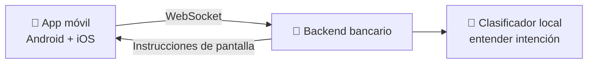
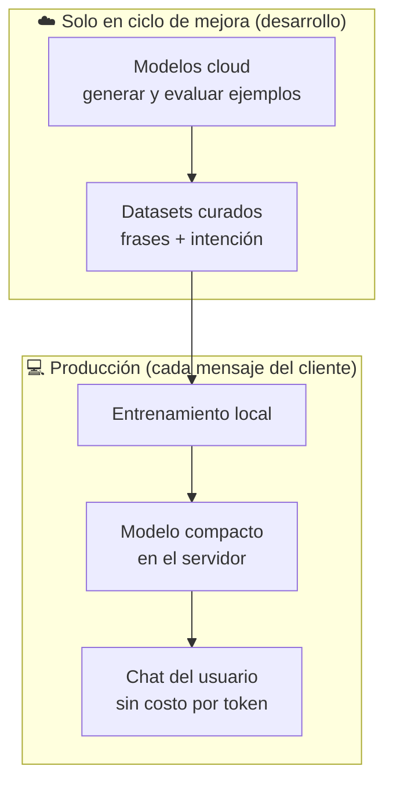
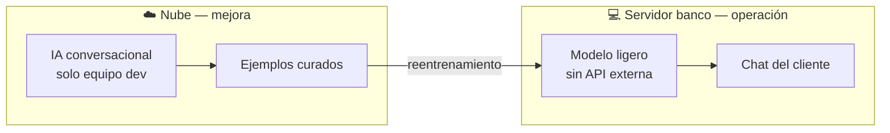
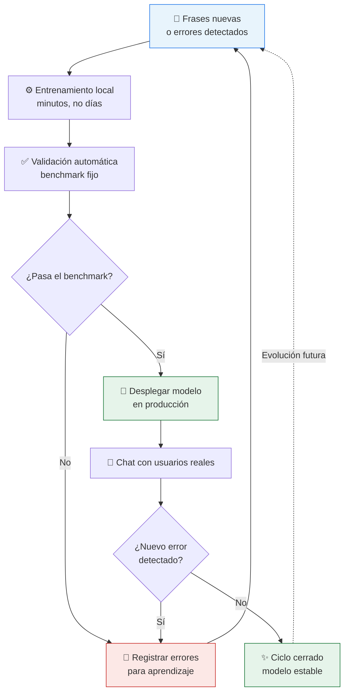
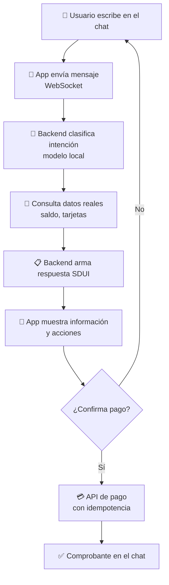
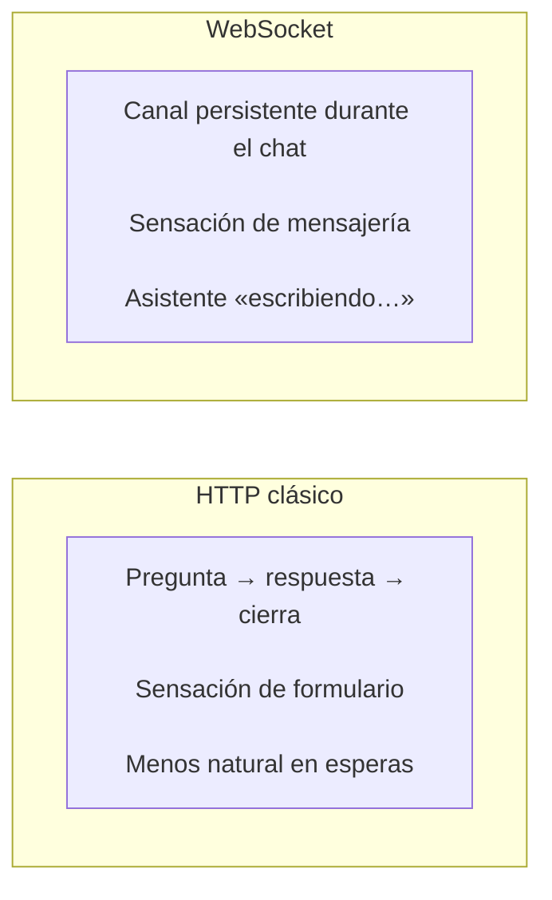
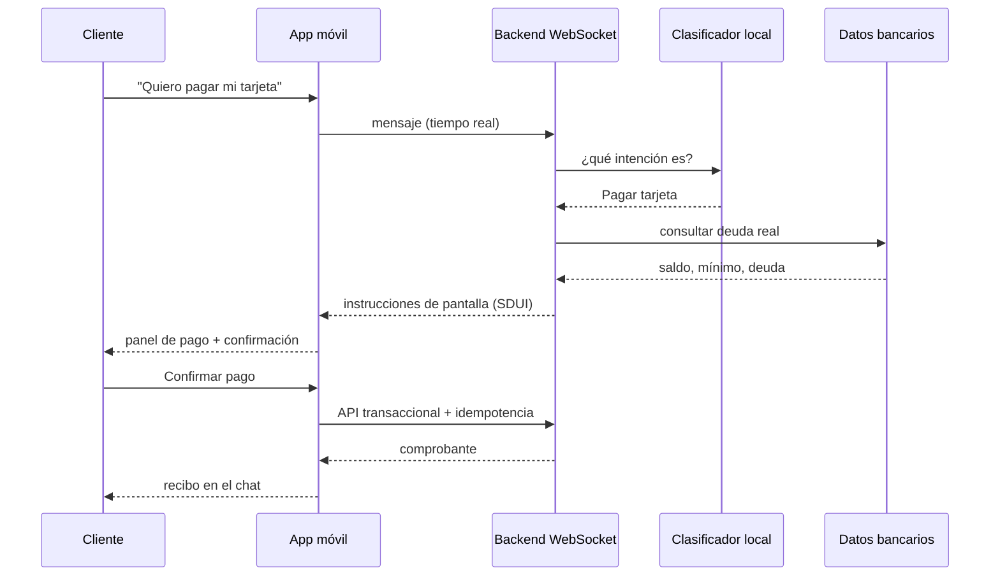

# Presentación para negocio
## App bancaria con asistente de IA inteligente y eficiente

**Audiencia:** stakeholders no técnicos  
**Duración sugerida:** 20–25 minutos  
**Mensaje central:** Un banco en el bolsillo con un asistente que entiende lenguaje natural, **sin depender de modelos caros en cada conversación**, y con **controles bancarios reales**.

---

## Slide 1 — Portada

**App bancaria + Asistente IA**  
Operaciones del día a día, conversación natural y costos controlados

*App móvil · Backend seguro · IA local en producción*

---

## Slide 2 — Qué es este proyecto

Una **aplicación bancaria real** para **Android e iOS**, conectada a un **backend**, y un **chat con asistente IA** que permite decir cosas como:

> *“¿Cuánto tengo?”*  
> *“Quiero pagar mi tarjeta”*

El sistema **entiende la intención**, **muestra la información correcta** y, si hay movimiento de dinero, **pide confirmación explícita** antes de ejecutar.

---

## Slide 3 — El problema de negocio

| Hoy (apps tradicionales) | Con este enfoque |
|--------------------------|------------------|
| Menús y formularios rígidos | Lenguaje natural en el chat |
| Cada cambio de pantalla = nueva versión de app | Muchas mejoras de conversación **sin actualizar la app** |
| Chat con IA “puro” = costo por mensaje + riesgo | IA **ligera en producción** + reglas bancarias en el servidor |

---

## Slide 4 — Tres piezas que trabajan juntas

| Pieza | Rol en negocio |
|-------|----------------|
| **App móvil** | Experiencia del cliente: login, inicio, chat |
| **Backend** | Fuente de verdad: saldos, deudas, pagos, etc |
| **IA local** | Entiende *qué quiere* el usuario, no inventa cifras |

---

## Slide 5 — Principio clave (seguridad y confianza)

> **La IA no es el banco. El backend es el banco.**

- La IA **clasifica** (“quiere pagar tarjeta”, “pregunta saldo”, “fuera de alcance”).  
- El backend **consulta datos reales** en base de datos.  
- El backend **valida fondos, límites y reglas**.  
- **Ningún pago** se ejecuta solo porque el modelo “creyó” entender al usuario.  
- El usuario debe **confirmar** explícitamente antes de mover dinero.

*Analogía:* la IA es el recepcionista que entiende la petición; el cajero autorizado es el sistema bancario.

---

## Slide 6 — El chat de IA: visión de negocio

El asistente reconoce **intenciones bancarias**:

| Intención | Ejemplo del usuario |
|-----------|---------------------|
| Consultar saldo | “¿Cuánto tengo en la cuenta?” |
| Pagar tarjeta | “Quiero abonar la TC” |
| Transferencias | “Pásame plata a mi otra cuenta” |
| Ambiguo | “Ayúdame con eso” → pide aclaración |
| Fuera de alcance | “¿Qué tiempo hace?” → deriva a soporte |

**Beneficio:** el cliente no memoriza menús; el banco guía la operación.

---

## Slide 7 — Estrategia de IA: nube para aprender, local para operar

**Dos fases complementarias** (no compiten; se refuerzan):

### Fase A — Desarrollo y mejora (puede usar la nube)

- Modelos grandes en la nube ayudan a:
  - **Generar variantes** de frases (“20 formas de pedir saldo”).
  - **Evaluar** si el sistema entiende bien un conjunto de pruebas fijo.
  - **Detectar errores** y proponer ejemplos de entrenamiento.
- El resultado **no es un chat en producción**: son **datos curados** (frases + intención correcta), revisados por humanos.

### Fase B — Producción (sin tokens, sin costo por mensaje)

- Un **modelo pequeño en el servidor** decide la intención en **milisegundos**.
- **No consume tokens** de APIs externas en cada mensaje del cliente.
- **Costo predecible** y **latencia baja**.

---

## Slide 8 — Cómo se “baja” el aprendizaje de la nube a local

**Metáfora:** la nube es la **academia**; el modelo local es el **empleado entrenado** que atiende al público todos los días.

| Paso | Qué pasa | Valor de negocio |
|------|----------|------------------|
| 1 | Se recopilan frases reales y variantes (con ayuda cloud opcional) | Cobertura de jerga, errores ortográficos, regionalismos |
| 2 | Un experto **valida** etiquetas (“esto es pagar tarjeta”, no saldo) | Calidad y cumplimiento |
| 3 | Se **entrena** un modelo compacto en el equipo | Artefacto reutilizable, sin API |
| 4 | Se prueba contra un **benchmark fijo** (regresión) | “No rompimos lo que ya funcionaba” |
| 5 | Errores del chat se guardan → **reentrenamiento** | Mejora continua con feedback real |
| 6 | El backend usa ese modelo para **cada mensaje** | Escala sin factura de IA por conversación |

**Dato importante:** en producción **no** se llama a modelos cloud por cada mensaje del cliente. La nube acelera **crear y mejorar** el conocimiento; el día a día corre **local**.

---

## Slide 9 — ¿Se podría usar IA “grande” también en local (como en la nube)?

**Pregunta habitual:** *“Si en desarrollo usamos Claude/GPT, ¿por qué no correr eso mismo en nuestro servidor y olvidarnos de la API?”*

**Respuesta honesta:**

| | Hoy en este proyecto | ¿Es posible en la industria? |
|---|---------------------|------------------------------|
| **Producción (chat del cliente)** | Modelo **ligero entrenado por nosotros** — entiende intenciones, **no conversa libremente** | Sí existen IA locales “tipo ChatGPT”, pero **no las usamos aquí** para cada mensaje |
| **Desarrollo / mejora** | Claude u OpenAI **solo** para enriquecer ejemplos y pruebas | Opcional; con costo de API acotado al equipo |

**Por qué elegimos modelo ligente en producción:**

- **Costo predecible:** cero “tokens” por mensaje del cliente (aunque un LLM local evita API, consume mucha máquina).
- **Velocidad:** respuesta en milisegundos, sensación de chat fluido.
- **Control y auditoría:** comportamiento estable; cada mejora pasa por datasets revisados y pruebas fijas.
- **Riesgo bancario:** la IA **solo interpreta** la petición; **saldo y pagos** los decide el backend con reglas, no el modelo conversacional.

**Qué “baja” de la nube al local (sin confusión):**

- **No baja** un ChatGPT instalado en el servidor.
- **Sí bajan** frases de entrenamiento curadas (ej.: más formas de decir “quiero pagar la tarjeta”) que el modelo ligero **aprende** en un reentrenamiento periódico.

**Opciones futuras (si el negocio lo pide):** modelos locales más potentes o semánticos — siempre **después** de validar costo de infraestructura, latencia y cumplimiento. Detalle técnico: [`presentacion-dev-chat-ia.md`](presentacion-dev-chat-ia.md) slide 17.

---

## Slide 10 — Ciclo de mejora continua

**Ventajas para negocio:**

- Mejora **versionada** y **auditable** (datasets en control de cambios).
- No hay “aprendizaje libre” en caliente en producción (riesgo bancario).
- El equipo puede iterar **sin re-lanzar la app** en muchos casos de conversación.

---

## Slide 11 — Del mensaje del usuario a la pantalla

---

## Slide 12 — WebSocket: por qué conversación “en vivo”

En lugar de “preguntar y esperar una página que se recarga”, la app mantiene un **canal abierto** con el banco:

**Para negocio:** experiencia comparable a apps de mensajería, con la robustez de un core bancario detrás.

---

## Slide 13 — SDUI: el servidor diseña la pantalla del chat

**Server-Driven UI (SDUI)** = *“El banco manda qué mostrar; la app solo lo presenta.”*

**Antes:** la app decidía qué mostrar según la intención → muchas versiones de app para cambiar textos u orden.

**Ahora:** el backend envía **instrucciones estructuradas** con el contenido y las acciones permitidas (textos, montos, botones de confirmación, enlaces de soporte).

**Beneficios comerciales:**

- Cambiar textos, orden o flujos **sin publicar nueva app** (dentro de un catálogo acordado).
- **Una sola verdad** sobre qué se mostró tras cada intención.
- **Pruebas A/B** de conversación centralizadas (futuro).

*La app no improvisa la experiencia de negocio: ejecuta lo que el servidor autoriza.*

---

## Slide 14 — Una sola app, Android e iOS

La interfaz móvil se desarrolla **una vez** y se despliega en **dos plataformas**.

| Enfoque tradicional | Este proyecto |
|---------------------|---------------|
| Equipos Android e iOS duplicados | **Un código** de pantallas compartido |
| Inconsistencias visuales | Misma experiencia de chat e inicio |
| Dos ciclos de release | Un ciclo para la experiencia compartida |

**Para negocio:** time-to-market, marca consistente y menor costo de mantenimiento en la capa que ve el cliente.

---

## Slide 15 — Arquitectura en una imagen

---

## Slide 16 — Seguridad y cumplimiento

- **Autenticación** con sesión en cada operación sensible.  
- **Confirmación explícita** antes de pagos.  
- **Idempotencia:** repetir la misma acción no cobra dos veces.  
- **Sin datos sensibles** de tarjeta en el chat.  
- **Trazabilidad:** cada respuesta del chat lleva un **correlationId** para auditoría.  
- **Clasificador no ejecuta dinero:** solo enruta; el pago pasa por API transaccional validada.

---

## Slide 17 — Beneficios resumidos para el negocio

| Dimensión | Beneficio |
|-----------|-----------|
| **Costo IA** | Producción sin facturación por token; nube solo en mejora |
| **Experiencia** | Chat natural + información y acciones en tiempo real |
| **Agilidad** | SDUI permite iterar conversación sin release constante |
| **Escala** | Modelo local rápido y predecible |
| **Riesgo** | Backend como autoridad; confirmación e idempotencia |
| **Canales** | Una base para Android e iOS |

---

## Slide 18 — Preguntas frecuentes (Q&A)

**¿Usamos un LLM en producción por cada mensaje?**  
No. Usamos un modelo **local entrenado**; la nube ayuda a **mejorar** ese modelo en desarrollo.

**¿Podríamos instalar ChatGPT/Claude en nuestro servidor?**  
Técnicamente sí en la industria, pero **no es lo que hacemos hoy**: sería más lento, más caro en infraestructura y menos predecible. Lo local que usamos es un **clasificador entrenado**, no un chat abierto. Ver slide 9.

**¿Qué aprende exactamente el modelo local de lo que hace la nube?**  
**Frases y categorías** validadas por humanos (ej.: “abonar la visa” = pagar tarjeta), no la “inteligencia” del proveedor cloud.

**¿La IA puede inventar un saldo?**  
No en el flujo diseñado: los montos vienen del **backend y la base de datos**.

**¿Qué pasa si el usuario se equivoca de intención?**  
Umbrales de confianza → **pide aclaración** o muestra soporte; no ejecuta operaciones ambiguas.

**¿Por qué WebSocket y no solo HTTP?**  
Mejor experiencia conversacional en tiempo real (canal persistente, sensación de chat).

**¿Por qué SDUI?**  
Agilidad de producto y control centralizado de qué ve el cliente en el chat.

---

## Notas para el presentador

- **Evitar jerga técnica:** hablar de “modelo ligero local”, “entrenamiento en equipo”, “interfaz compartida Android/iOS”, no de nombres de librerías o componentes internos.
- **Énfasis en costos:** la nube es inversión en **calidad del entrenamiento**, no en **costo variable por usuario**.
- **Énfasis en riesgo:** repetir que pagos = confirmación + backend + idempotencia.
- **Duración orientativa:** ~2 min slides 1–7 · ~5 min slide 9 (IA local vs nube) · ~8 min ciclo y chat (10–15) · ~5 min cierre + Q&A.

---

## Cómo visualizar este documento

- **VS Code / Cursor:** vista previa Markdown (`Cmd+Shift+V` / `Ctrl+Shift+V`); los diagramas Mermaid se renderizan con extensión Mermaid o en GitHub.
- **GitHub:** abrir este archivo en el repo; Mermaid se renderiza nativamente.
- **Versión técnica (devs):** [`presentacion-dev-chat-ia.md`](presentacion-dev-chat-ia.md) — glosario IA, LLM local, comandos.
- **Exportar a PDF:** extensión “Markdown PDF” o [Marp](https://marp.app/) si se añade front matter de presentación.
- **Presentación en pantalla completa:** herramientas como [Slidev](https://sli.dev/) o Marp importando secciones por slide (`## Slide N`).
