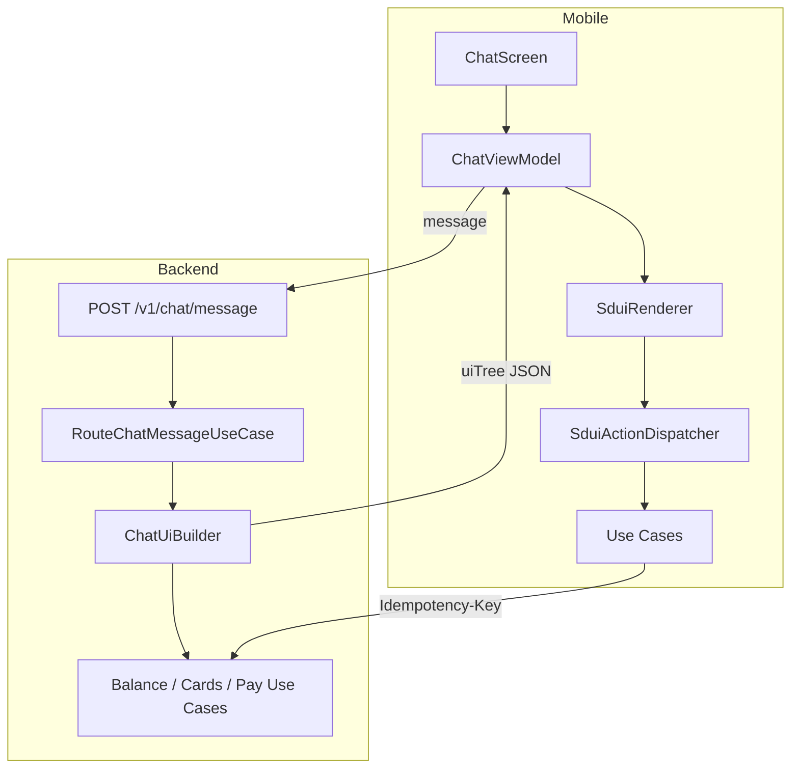

# Server-Driven UI — Blueprint para este proyecto

Guía del chat bancario con **SDUI implementado** (mobile renderiza; backend arma `uiTree`).
Blueprint de IA de referencia: `docs/ai-chat-backend-blueprint.md`.

## 1. Flujo actual (implementado)

```
Usuario → POST /v1/chat/message → { uiTree, correlationId, metadata }
       → SduiRenderer (PayCardChatPanel, BalanceCard, …)
       → Pago: PayCreditCardUseCase → POST /v1/credit-cards/{id}/payments
```

Legacy (solo clasificación, eval de intents): `POST /v1/chat/route`.

## 1b. Problema que resolvía SDUI

Antes el mobile decidía la UI según `intent` y hacía llamadas extra (GET tarjetas, saldo). SDUI centraliza el armado en backend (`application/sdui/` + `BuildChatUiUseCase`):

```
Usuario → POST /v1/chat/message → { uiTree, actions, correlationId }
       → SduiRenderer pinta el árbol
       → Usuario pulsa acción → POST /v1/chat/action (o endpoint transaccional existente)
```

Ventajas en banca:
- Iterar copy, orden de componentes y A/B tests sin release de app (con catálogo estable).
- Una sola fuente de verdad para “qué se muestra” tras clasificar intención.
- Auditoría centralizada del árbol servido por `correlationId`.

Limitaciones:
- No reemplaza el catálogo de Composables en mobile (solo describe instancias).
- Operaciones de dinero **siguen** ejecutándose vía API transaccional + idempotency.

---

## 2. Arquitectura propuesta



### Capas nuevas (sin romper hexagonal)

| Módulo | Paquete sugerido | Responsabilidad |
|--------|------------------|-----------------|
| backend/domain | `domain.model.sdui` | `UiNode`, `UiAction`, `UiResponse` |
| backend/application | `application.sdui` | `ChatUiBuilder`, builders por intent |
| backend/application | `application.usecase` | `BuildChatUiUseCase` (orquesta classify + build) |
| backend/api | `api.dto` | DTOs serializables + ruta |
| mobile/domain | `domain.model.sdui` | Mismos modelos (ideal: módulo shared futuro) |
| mobile/presentation | `presentation.sdui` | Renderer + dispatcher |

---

## 3. Catálogo de componentes (v1)

Mapeo directo desde UI **ya existente** en mobile:

| type (SDUI) | Composable actual | Props principales |
|-------------|-------------------|-------------------|
| `AssistantText` | `AssistantMessageBubble` | `text`, `timestampEpochMs` |
| `UserText` | burbuja azul en `ChatScreen` | `text`, `timestampEpochMs` |
| `BalanceCard` | `ChatBalanceMiniCard` | `amountFormatted`, `currency` |
| `PayCardPanel` | `PayCardChatPanel` | `cardId`, `alias`, `debt`, `minimumPaymentDue`, `statementBalanceDue`, `currency`, … |
| `SupportChannelsCard` | `OutOfScopeSupportCard` | URLs de soporte (desde config backend) |
| `PaymentReceiptCard` | `PaymentSuccessReceiptCard` | `amountPaid`, `movementId`, `currency`, … |
| `InfoBanner` | nuevo átomo simple | `text`, `severity` |
| `Column` | contenedor | `children[]` |
| `TypingIndicator` | `ChatTypingDots` | — |

**Regla:** no añadir `type` sin Composable en mobile y test en `SduiRendererTest`.

---

## 4. Contrato JSON (schemaVersion 1)

### Respuesta de mensaje

```json
{
  "schemaVersion": 1,
  "correlationId": "550e8400-e29b-41d4-a716-446655440000",
  "metadata": {
    "intent": "PAY_CREDIT_CARD",
    "confidence": 0.93,
    "clarificationNeeded": false
  },
  "uiTree": {
    "id": "root",
    "type": "Column",
    "children": [
      {
        "id": "intro",
        "type": "AssistantText",
        "props": {
          "text": "Estas son tus tarjetas con deuda. Elige cómo quieres pagar."
        }
      },
      {
        "id": "card-gold",
        "type": "PayCardPanel",
        "props": {
          "cardId": "CARD-001",
          "alias": "Oro",
          "lastFourDigits": "1234",
          "cardholderName": "MARIA LOPEZ",
          "expiryMonth": 12,
          "expiryYear": 2028,
          "debt": 4200.0,
          "minimumPaymentDue": 420.0,
          "statementBalanceDue": 1200.0,
          "currency": "PEN"
        },
        "actions": [
          {
            "id": "pay-full-CARD-001",
            "label": "Pagar deuda total",
            "actionType": "PAY_CARD",
            "requiresConfirmation": true,
            "payload": {
              "cardId": "CARD-001",
              "paymentMode": "FULL_DEBT"
            }
          }
        ]
      }
    ]
  }
}
```

### Acción del usuario (opcional, fase 2)

```json
POST /v1/chat/action
{
  "correlationId": "550e8400-...",
  "actionId": "pay-full-CARD-001",
  "confirmed": true
}
```

Alternativa más simple en v1: mobile sigue usando `PayCreditCardUseCase` directamente al pulsar, sin round-trip extra; el SDUI solo define **layout**, no el transporte de la acción.

---

## 5. Implementación backend (paso a paso)

### Paso 1 — Modelos de dominio

```kotlin
// backend/domain/.../sdui/UiNode.kt
data class UiNode(
    val id: String,
    val type: String,
    val props: Map<String, String> = emptyMap(), // simplificar v1; JsonElement en v2
    val children: List<UiNode> = emptyList(),
    val actions: List<UiAction> = emptyList(),
)
```

### Paso 2 — Builder por intención

```kotlin
// backend/application/sdui/PayCreditCardUiBuilder.kt
class PayCreditCardUiBuilder(
    private val cardsUseCase: ListCreditCardsWithDebtUseCase,
) {
    suspend fun build(sessionToken: String): UiNode {
        val cards = cardsUseCase.execute(sessionToken)
        return UiNode(
            id = "root",
            type = "Column",
            children = listOf(
                assistantText("Elige tarjeta y modo de pago."),
            ) + cards.map { it.toPayCardPanelNode() },
        )
    }
}
```

### Paso 3 — Orquestador

```kotlin
// BuildChatUiUseCase
suspend fun execute(token: String, message: String): UiResponse {
    val route = routeChatMessageUseCase.execute(message)
    val tree = when (route.classification.intent) {
        IntentLabel.CHECK_BALANCE -> balanceUiBuilder.build(token)
        IntentLabel.PAY_CREDIT_CARD -> payCardUiBuilder.build(token)
        IntentLabel.AMBIGUOUS -> clarificationBuilder.build()
        IntentLabel.OUT_OF_SCOPE -> supportBuilder.build()
        else -> notImplementedBuilder.build(route)
    }
    return UiResponse(schemaVersion = 1, correlationId = newId(), uiTree = tree, metadata = route)
}
```

### Paso 4 — Ruta API

```kotlin
post("/chat/message") {
    call.requireSession(root)
    val body = call.receive<ChatMessageRequest>()
    val token = call.requireBearerToken()
    call.respond(root.buildChatUiUseCase.execute(token, body.message).toDto())
}
```

### Paso 5 — Tests

- `PayCreditCardUiBuilderTest`: 0 tarjetas → `InfoBanner`; 2 tarjetas → 2 `PayCardPanel`.
- `BuildChatUiUseCaseTest`: intent mock → árbol esperado.
- Snapshot JSON en `api/src/test/resources/sdui/`.

---

## 6. Implementación mobile (paso a paso)

### Paso 1 — Modelos + deserialización

Copiar DTOs compatibles con backend (`kotlinx.serialization`, `ignoreUnknownKeys = true`).

### Paso 2 — Renderer

```kotlin
@Composable
fun SduiRenderer(
    node: UiNode,
    payingCardId: String?,
    onAction: (UiAction) -> Unit,
) {
    when (node.type) {
        "PayCardPanel" -> {
            val action = node.toPayCardChatAction()
            PayCardChatPanel(
                action = action,
                paying = payingCardId == action.cardId,
                paymentsDisabled = payingCardId != null,
                onPay = { mode -> node.actions.firstOrNull()?.let { onAction(it.copy(payload = it.payload + ("paymentMode" to mode.name))) } },
            )
        }
        // ...
    }
}
```

### Paso 3 — ChatViewModel simplificado

```kotlin
// Antes
when (route.intent) {
    "PAY_CREDIT_CARD" -> loadPayCreditCardRoute(...)
    "CHECK_BALANCE" -> loadCheckBalanceRoute(...)
}

// Después
val response = chatRepository.sendMessage(token, text)
_state.update { it.copy(sduiNodes = flatten(response.uiTree)) }
```

Estado: `ChatUiState(messages: List<UiNode>, ...)` o híbrido durante migración.

### Paso 4 — Feature flag

```kotlin
if (FeatureFlags.useSduiChat) {
    // nuevo flujo
} else {
    // ChatViewModel actual
}
```

### Paso 5 — Tests

- Deserialización JSON → `UiNode`.
- Renderer: cada `type` del catálogo.
- Dispatcher: `PAY_CARD` + `requiresConfirmation` → no ejecuta sin confirm.

---

## 7. Seguridad y cumplimiento

| Riesgo | Mitigación SDUI |
|--------|-----------------|
| UI engañosa que impulse pago | Solo tipos del catálogo; review de nuevos `type` en PR |
| Montos incorrectos | Props calculados en backend desde DB, nunca desde el clasificador ML |
| Pago accidental | `requiresConfirmation: true` + sheet nativo antes de POST payment |
| Replay de acciones | `correlationId` + idempotency en endpoint de pago |
| Schema breaking | `schemaVersion`; mobile ignora props desconocidas |

---

## 8. Estado de migración

| Fase | Estado |
|------|--------|
| Modelos SDUI + `SduiRenderer` + `POST /v1/chat/message` | **Hecho** |
| Builders: saldo, pago TC, clarificación, soporte, transferencias no implementadas | **Hecho** |
| Mobile sin `when(intent)` en `ChatViewModel` | **Hecho** |
| Comprobante post-pago en cliente (`paymentReceipt`) | Pendiente (opcional mover a SDUI) |
| `/v1/chat/route` | Se mantiene para eval de intenciones (`local/`) |

**Importante:** tras reiniciar el backend con código reciente debe existir `POST /v1/chat/message` (404 = servidor viejo).

---

## 9. Qué no migrar a SDUI (v1)

- **Login / Home / navegación principal** — siguen client-driven (estables, poco beneficio).
- **Formularios complejos con validación en tiempo real** — mejor nativos.
- **Clasificador Python / datasets** — no cambian; alimentan el builder vía intent.

---

## 10. Comandos de validación post-implementación

```bash
cd backend && ./gradlew test
cd mobile && ./gradlew :composeApp:testDebugUnitTest
python3 local/scripts/simulate_intent_validation.py   # intención sigue igual; SDUI es capa de presentación server-side
```

---

## Referencias

- Reglas: `.cursor/rules/60-server-driven-ui-principles.mdc`, `61-sdui-backend-contract.mdc`, `62-sdui-mobile-renderer.mdc`
- Contrato intención (sin cambio): `docs/intent-routing-contract.md`
- UI actual: `ChatScreen.kt`, `PayCardChatPanel.kt`, `ChatBubble.kt`
